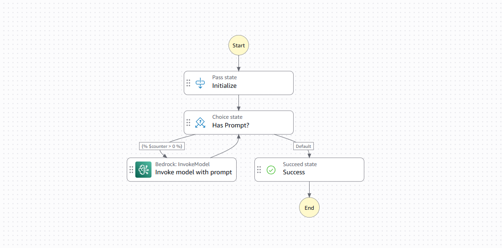
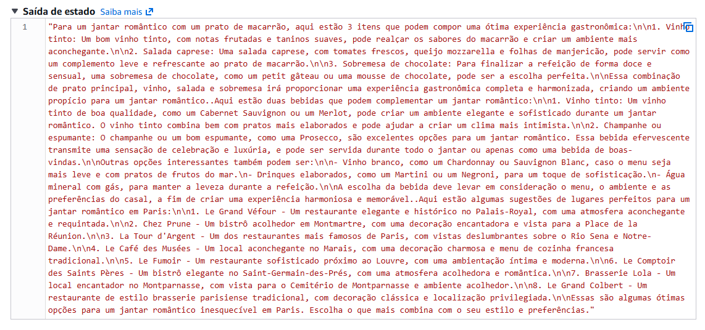

# Projeto DIO - AWS Step Functions + Bedrock

Este projeto demonstra a integração entre AWS Step Functions e Amazon Bedrock utilizando o modelo Claude 3 Haiku para processar múltiplos prompts em sequência.

## Tecnologias
- AWS Step Functions
- Amazon Bedrock
- Anthropic Claude 3 Haiku
- JSONata

## Funcionamento
A máquina:
1. Recebe múltiplos prompts
2. Processa cada prompt em loop
3. Armazena as respostas
4. Retorna o resultado final consolidado

## Resultado da Execução
O fluxo processa a cadeia de prompts em loop utilizando o Amazon Bedrock e retorna o output consolidado de forma sequencial. Abaixo está o print da execução com sucesso:

